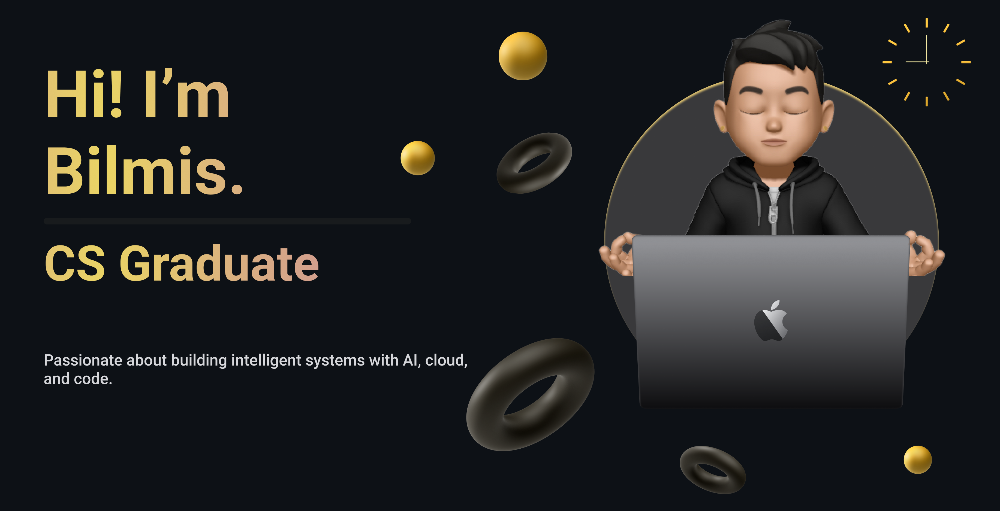

<h3 align="center">CS Graduate | Software Developer | AI & Cloud Enthusiast| Problem Solver</h3>

I'm Bilmis Afthash Meeran, a BTech Computer Science Graduate from College Of Engineering Trivandrum

- 🔭 Recently finished Project: [Gemini-Powered-AI-Assistant](https://d27dsq3yzkj3os.cloudfront.net/)

- 🌱 I’m currently learning **NLP,Generative AI and Kubernetes**

- 👨‍💻 All of my projects are available at [Projects-Link](https://github.com/Bilmis?tab=repositories)

- 💬 Ask me about **my university and experience**

- 📫 How to reach me **bilmisafthash18@gmail.com**

- 📄 Know about my experiences: [Resume-Link](https://drive.google.com/file/d/1vnsXYWOn_Pr-Vd94aY5dlqMGjOhl4adJ/view?usp=drive_link)
- ⚡ Fun fact **I think I have a good humour Sense😁**

<h3 align="left"></h3>

## 🌐 Socials:
  

# 💻 Tech Stack:
                    

# 📊 GitHub Stats:
 
 

---

<!-- Proudly created with GPRM ( https://gprm.itsvg.in ) -->
